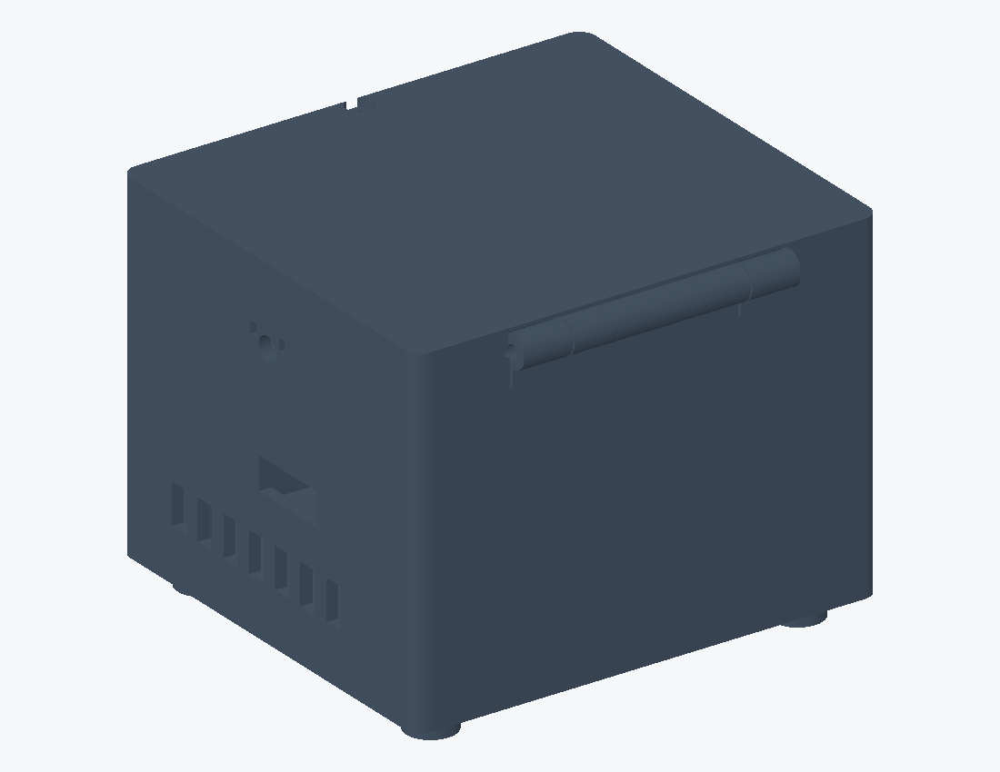

# AeroSense assembly manual

Purpose: four separate liquid wells with a shared gas path, close to the four LEDs on the existing PCB and one collection PD. Nominal PCB: 100 x 90 mm; not yet fabricated. This is a complete engineering-prototype assembly procedure, not evidence of physical fit.

Sequence: materials → vendor board dimensions → print coupons and dry parts → unpowered fitting → electronics → cell-free optical/gas tests → material and cell qualification. Stop at a failed gate; forcing parts or normalizing the signal does not resolve a physical defect.

STL/ contains eight operating parts. The two files in OPTION_accessible_cap replace part 04, giving nine operating prints. Do not stack both cap options. STLs are in mm, without supports; STL files do not encode units.

# 1. Materials, tools and printing

| Part | Resin / quantity |
| 01 integrated body | Rigid PC/GF-like Black x1 |
| 02 tray and PCB posts | Aqua 8K Gray x1 |
| 03 hinged outer lid | Rigid PC/GF-like Black x1 |
| 04 shared gas/optical cap | Rigid PC/GF-like Black x1 |
| 05 flat-bottom wells | Aqua Clear Plus x4, one per NE/NW/SW/SE |

Aqua Clear Plus is for fit/material testing, not a qualified HEK293T culture substrate. The black cap contacts sample gas and requires adsorption, residual and background testing. If the gray tray admits ambient light, print the same STL in Black without increasing part count.

Calibrate the Sonic Mighty Revo 16K with the actual resin batch; no guessed exposure time is specified. Trial the 0.15 mm side clearance, M3 nut pockets and 0.5 mm floor. Tilt large planes, drain well cavities and keep supports away from culture floors, seals and locating faces. Follow manufacturer washing, drying and curing instructions and measure after cure. Do not trap uncured resin in a cavity.

Tools: caliper, feeler gauge, M3/M4 hex tools, tweezers, scissors, appropriate PPE, multimeter and oscilloscope/logic analyzer; 0.8 mm silicone stock. Quantities and costs are in the separate BOM. Do not self-tap, hammer or repeatedly flex brittle resin.

# 2. Registration and pre-fabrication checks

This assembly view faces the optical side, with the D5 package center at (0,0). Nominal LED centers are (+/-3.3,+/-5.7); liquid-well centers are (+/-3.3,+/-2.65). The provisional PDF mapping is D1=SW, D2=SE, D3=NE, D4=NW. Confirm bottom-view mirroring rather than inferring wiring from left/right positions.

The Vishay drawing places the optical center 2.1 mm from the bottom of the 5 mm package, giving a 0.4 mm long-axis offset. Its world direction depends on rotation. The model uses (0,-0.4) and sweeps reversal; wells remain LED-registered. The 3 x 2.5 mm detector is an equal-area 7.5 mm2 proxy, not a supplied die outline.

Request populated-board STEP, thickness, hole coordinates/diameters, battery-holder height including cell, USB-C/SW1 access envelopes, LED emission-window coordinates and PD rotation. The nominal +/-45 and +/-40 mm holes and 1.6 mm thickness are not vendor-certified.

# 3. Fan, PCB and tray

1. Disconnect power and remove the battery. Remove supports, burrs and dust; check all eight parts for warp and trapped resin. Seat M3 nuts in their capture pockets without protruding into mating faces.

2. Place the 40 x 40 x 10 mm fan on tray 02, centered at (0,-12), with 32 mm hole pitch. Use four M4x20 screw/washer/nut sets. Intake through the base, flow under the PCB, exhaust through electronics openings. The fan is not connected to the well gas path.

3. Check underside clearance: allowable component height is 23 mm over the fan body and only 16 mm over its fasteners, both with a nominal 2 mm margin. If the battery holder enters the low-clearance area, resolve the layout/height before assembly; do not remove required PCB supports.

4. Place the PCB optical-side up on four posts. Secure with four M3x10 screws and 0.5 mm washers without contacting traces or bending the board. Check underside gaps with a feeler gauge. 5. The vendor must confirm the fan 5 V/GND connection and supply margin; LED gates are not power outputs. Insulate and strain-relieve wiring, then attach body to tray with another four M3x10 screws.

6. USB-C/SW1 cutouts remain nominal until a real board is available. Check full connector-body insertion/removal, full switch travel and cable clearance from optics. Record measurements in validation/fit_measurements.csv.

# 4. Optics, wells and seals

7. Locate the opaque PD soft ring: nominal 4 x 4 mm outside, 3 x 3.4 mm opening, 0.8 mm stock compressed to 0.6. Avoid bonds and terminals. The margin around the offset detector is small: confirm the window outline and rotation and measure clipping under positioning tolerances. This is not a qualified optical seal specification.

8. Install a filter no larger than 5.2 x 4.2 x 1 mm in its seat, Z41.1 to42.1. Retain only at dry corners, away from the aperture. A colored transparent sheet is not a qualified emission filter; verify rejection across the LED spectrum and green transmission over the incidence cone.

9. Slide NE/NW/SW/SE into their matching seats with flanges resting at Z56.8. These are rigid keyed cartridges, not flexible snap fits. Outer floors are Z42.5 and inner floors Z43, both planar, with 0.5 mm thickness. Cavities are 4.7 x 3.4 mm. Nominal 150 uL gives Z52.387; theoretical brim capacity is about244.5 uL. Verify volume with cell-free liquid.

10. Cut the common four-aperture gasket: outer14 x11.4 mm, opening centers (+/-3.3,+/-2.65), each4.7 x3.4 mm. Compress 0.8 mm stock to0.6 against cap hard stops. Do not cover openings or squeeze the gasket into liquid. The wells share gas and are not gas-isolated.

# 5. Inner cap, gas path and hinged lid

11. Integral cap04 contains a full horizontal plate:12 holes, diameter1.6 mm, thickness1.2 mm, Z63 to64.2. Inlet is on negative X above the plate at Z65.7; outlet is positive X below the plate at Z61.5. Both bores are2.4 mm; tails are3.4 mm with4.0 mm retaining ridges. Seat two M3x10 thumbscrews against hard stops without crushing wells.

The upper chamber of the integral cap is difficult to inspect, clean and cure; use it for dry/cell-free testing. For accessible cleaning surfaces, use the two-part OPTION cap: divider in the lower piece, roof in the upper, asymmetric locating pins, and an extra22 x19 mm gasket with15 x12 opening. Substitute two M3x12 thumbscrews; total prints9. Material and seal qualification still apply.

12. Fit one hydrophobic0.2 um gas filter to inlet and one to exhaust. Use externally controlled flow and pressure limiting. Never block exhaust, inject directly into liquid, or use the cooling fan to evacuate wells. Stop inlet flow before closing, keep filtered exhaust open to atmosphere, lower the cap slowly and alternate the screws; resume flow only after pressure returns to zero.

13. Pass the M3x75 pin through the hinge, add end washers and a nyloc nut to retain it without clamping the barrels. Close the front with one M3x12 thumbscrew. The outer lid is not an airtight piston; the gas seal is at the wells and inner cap.

# 6. Replacement, inspection and troubleshooting

Replace wells: stop acquisition → LEDs off → stop gas and verify zero pressure → open outer lid → release both cap screws → lift cap vertically while supporting hoses → lift wells by flanges → handle liquid under laboratory procedures → replace wells and clean sealing faces → repeat dark, baseline and reference calibration. Do not invert the filled instrument.

| Symptom | Action |
| Stuck well / loaded PCB | Measure shrinkage, burrs, flange and component heights; do not force. |
| ADC near0 or full scale | Check TIA, wiring, ambient light and filter before normalization. |
| Low flow / rising pressure | Stop gas; inspect wet filters, kinked tubing, blocked holes and reversed ports. |
| Signal jumps after closing | Check pressure pulse, seal displacement, light leaks and positioning repeatability. |
| Purple resin / high blank signal | Measure transmission and empty-well autofluorescence; polishing does not remove bulk absorption. |

Dry acceptance: no collision/bending, full nut engagement, removable wells, no hose pull and accessible connectors. Wet acceptance: no liquid reaches the PCB during dwell, tilt and lid cycles at defined fill; repeatable pressure/flow at operating temperature. CAD renders are not prototype photographs or evidence of success.
