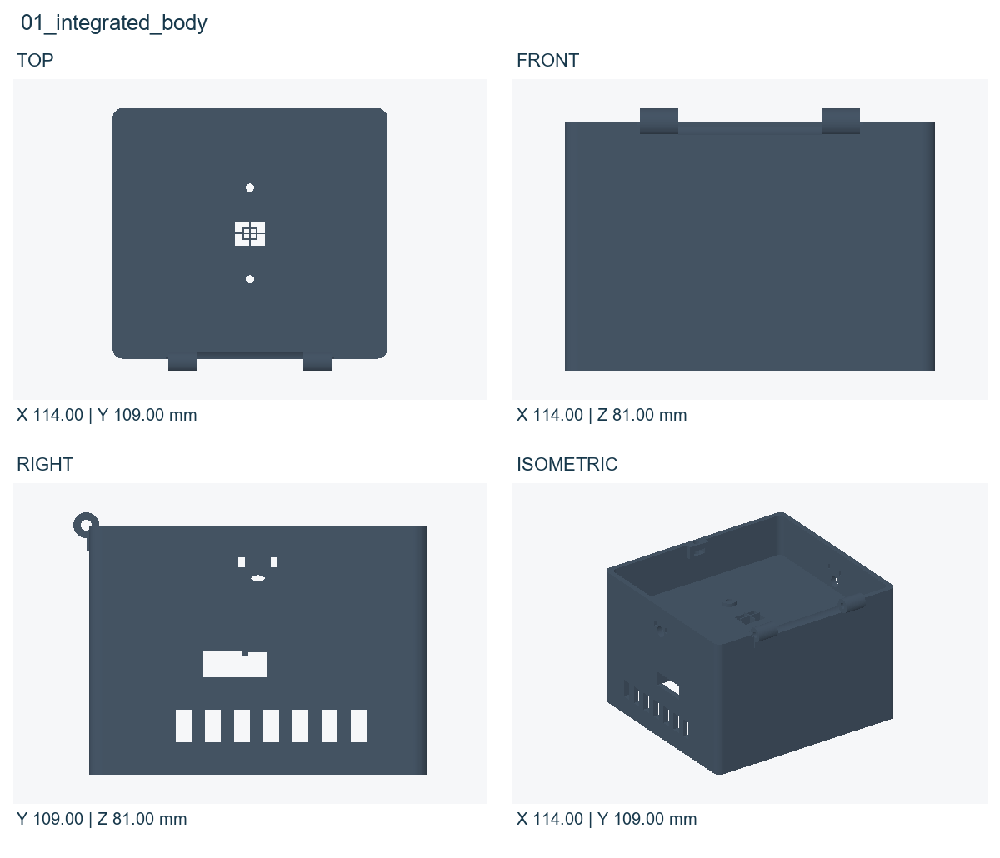
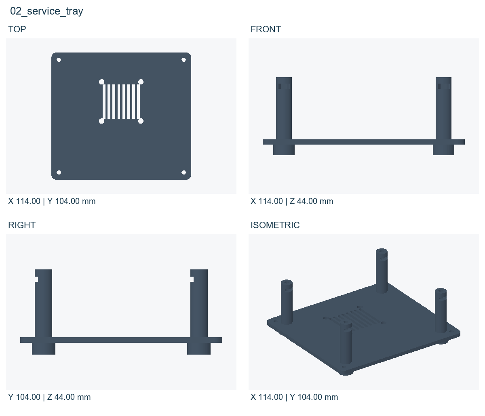
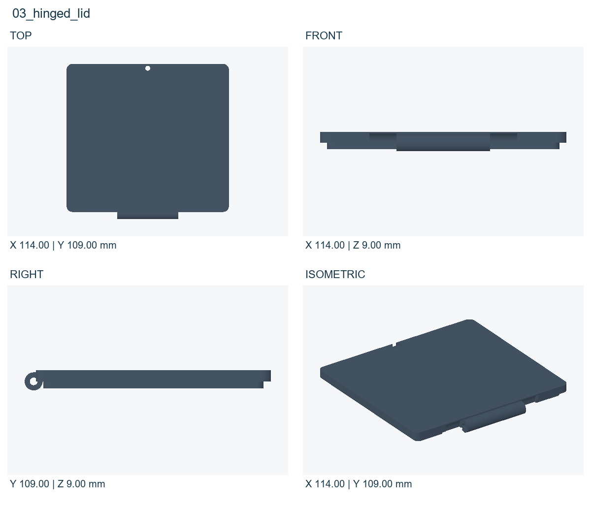
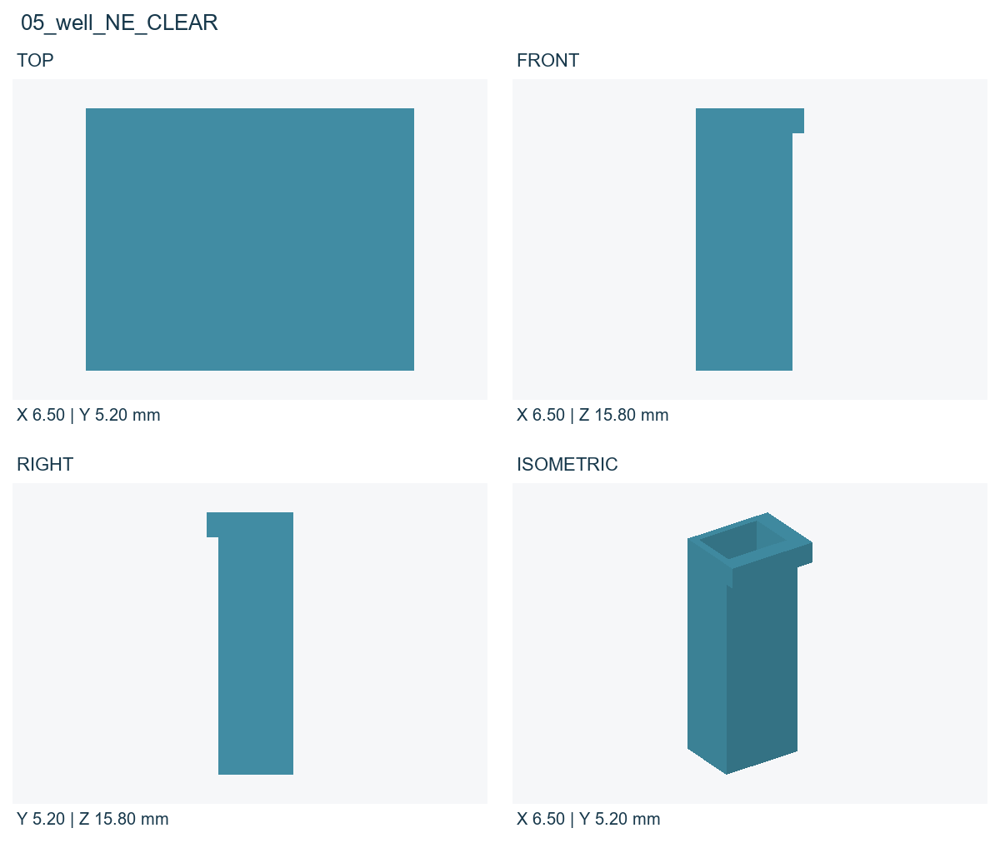
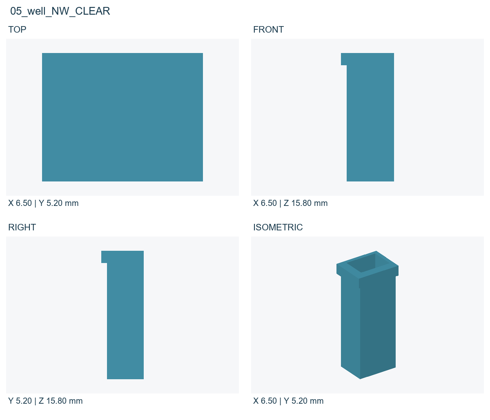
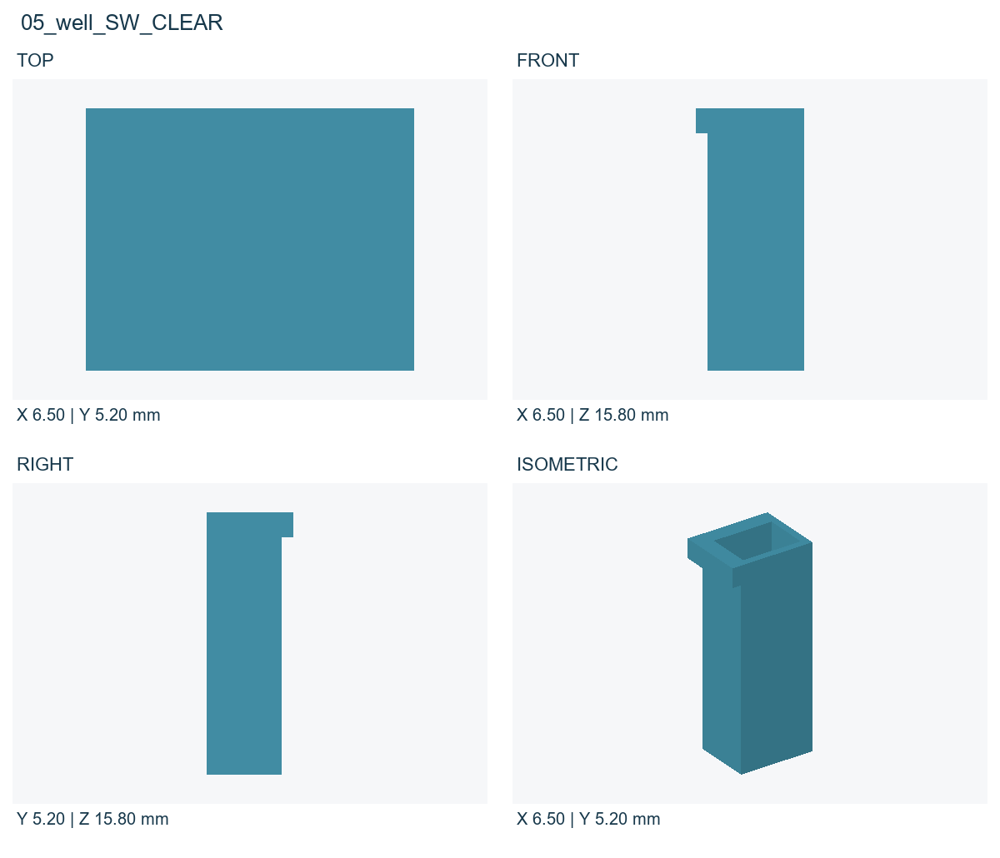
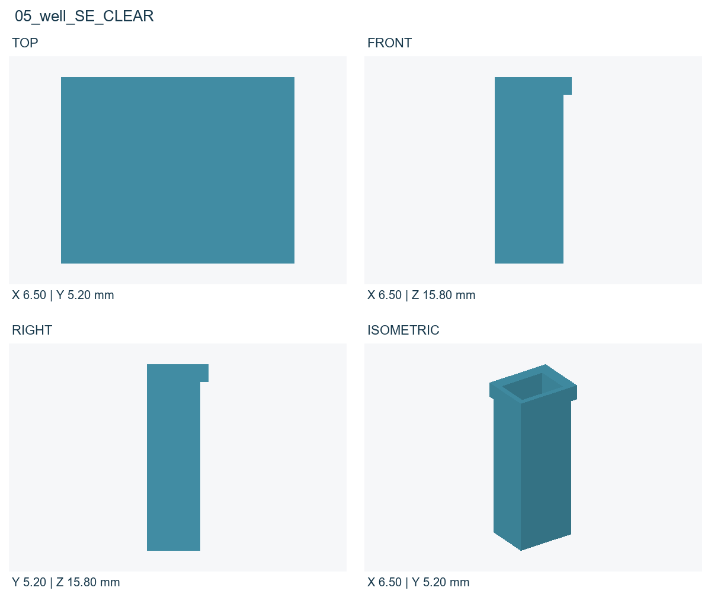
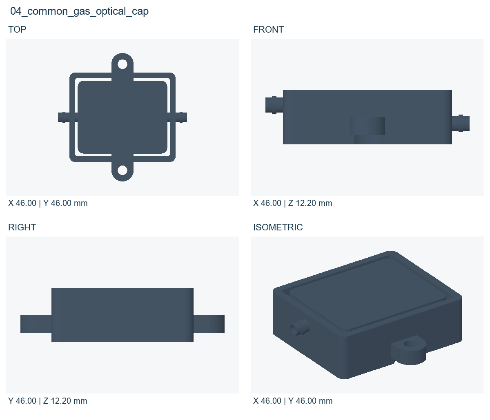

# 總裝與座標圖

爆炸間距只供說明，實際座標以CAD/assembly_coordinates與parts.json為準。名目外形114×109×91 mm，未含接管和五金突出。所有圖單位mm，零件圖是視圖與包络尺寸，並非完整GD&T製造圖。

# LED與PD光學對位

PD的0.4 mm偏移與well的LED定位是兩個獨立設定。封裝形狀、板孔與元件高度仍須廠商STEP確認；不要以這張圖推定精度已達±0.01 mm。

# 01_integrated_body

列印材料：PC_GF_BLACK。組裝座標最小點(mm)：[-57.0, -52.0, 3.0]。STL/檔案已平移至正座標；不能把所有print STL原點直接重疊組裝。

# 02_service_tray

列印材料：AQUA_8K_GRAY。組裝座標最小點(mm)：[-57.0, -52.0, -6.0]。STL/檔案已平移至正座標；不能把所有print STL原點直接重疊組裝。

# 03_hinged_lid

列印材料：PC_GF_BLACK。組裝座標最小點(mm)：[-57.0, -52.0, 76.0]。STL/檔案已平移至正座標；不能把所有print STL原點直接重疊組裝。

# 05_well_NE_CLEAR

列印材料：AQUA_CLEAR_PLUS_TEST_ONLY。組裝座標最小點(mm)：[0.4, 0.4, 42.5]。STL/檔案已平移至正座標；不能把所有print STL原點直接重疊組裝。

# 05_well_NW_CLEAR

列印材料：AQUA_CLEAR_PLUS_TEST_ONLY。組裝座標最小點(mm)：[-6.9, 0.4, 42.5]。STL/檔案已平移至正座標；不能把所有print STL原點直接重疊組裝。

# 05_well_SW_CLEAR

列印材料：AQUA_CLEAR_PLUS_TEST_ONLY。組裝座標最小點(mm)：[-6.9, -5.6, 42.5]。STL/檔案已平移至正座標；不能把所有print STL原點直接重疊組裝。

# 05_well_SE_CLEAR

列印材料：AQUA_CLEAR_PLUS_TEST_ONLY。組裝座標最小點(mm)：[0.4, -5.6, 42.5]。STL/檔案已平移至正座標；不能把所有print STL原點直接重疊組裝。

# 04_common_gas_optical_cap

列印材料：PC_GF_BLACK。組裝座標最小點(mm)：[-23.0, -23.0, 56.8]。STL/檔案已平移至正座標；不能把所有print STL原點直接重疊組裝。
