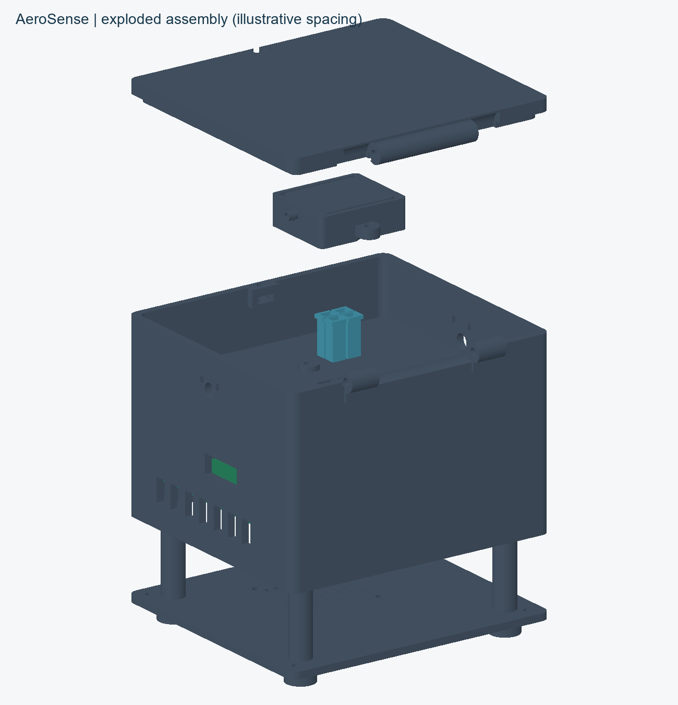
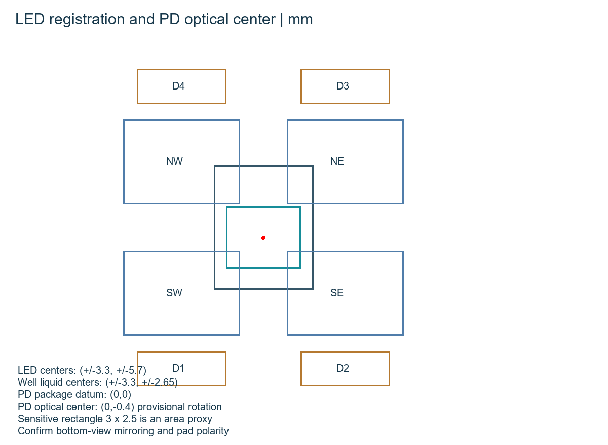
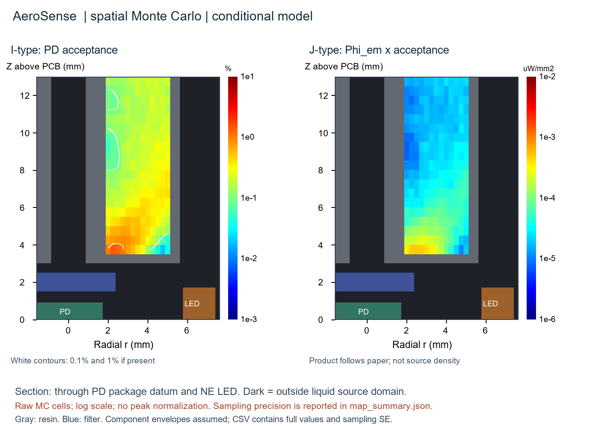
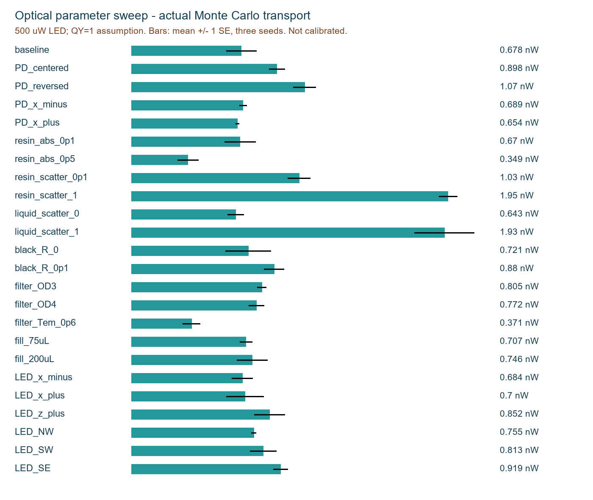
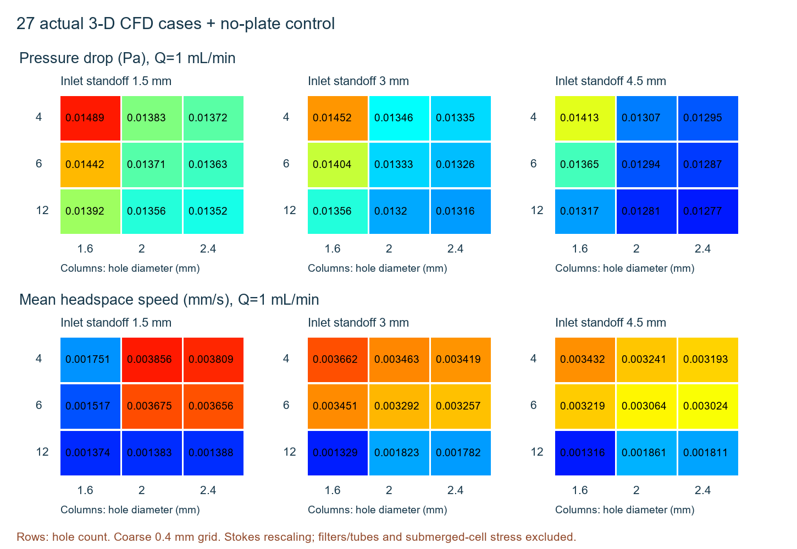
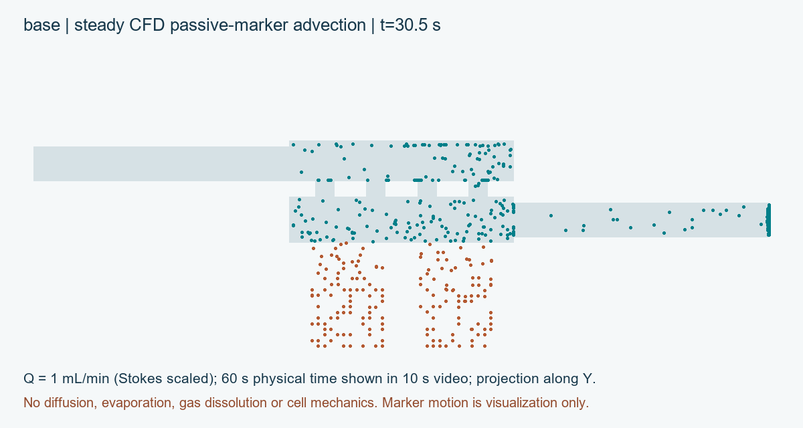
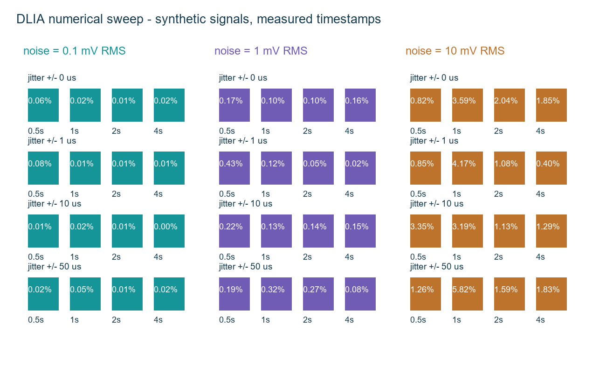

# AeroSense 工程分析報告

本報告將CAD、物理假設、數值解與實驗證據分開。已完成：平底井STL、24組光子傳輸參數條件、27組孔板CFD加無孔板對照、空間光場與感測接收圖、48組DLIA合成訊號測試、手機UI與可編譯ESP32程式。尚未完成：實板功能、實物配合、密封、樹脂／細胞相容與氣味辨識效能。

結論：原PCB具備四路LED驅動與一個16-bit ADC讀取路徑，可建置四頻系統；但「光路足夠、細胞可活、四井能分開量測」仍須實驗。低零件數與外觀不能取代驗證。

# 幾何、光學中心與公差

四井依各自LED的X座標定位，保留現有密集元件的避空；不是以PD封裝中心畫四個等距圓井。井底內外皆平，0.5 mm厚，名目150 µL。平底能控制幾何厚度，但斜入射、角度、反射與細胞分布仍會造成亮度不均。

PD偏移依Vishay圖面可確定是沿封裝長軸0.4 mm，但世界座標正負取決於BOTTOM圖鏡像及貼裝旋轉。主模型採(0,-0.4)，另算(0,0)、(0,+0.4)、X±0.2。感光區以3×2.5 mm等面積矩形近似，不把3×3 mm外部光窗當成全部有效die。名目filter座足以覆蓋，PD密封圈邊緣遮擋仍是實測項。

四井在四象限，不代表井中心向量每隔精確90度；也不能宣稱每一條LED→細胞→PD光線恆為90度。側向激發與向下收光是設計意圖，MC包含角分布。

# 光學方法與文獻圖的對應

參考Burton等人的Fig.2 I/J概念，但不能複製其halo作為本機結果：其微型LED/PD、濾片、染料溶液與尺寸均不同。本模型是毫米尺度透明井與底部20 µm細胞層，不是同一介質與幾何。

η(r)=該位置等向點源被PD接收的功率／點源發出功率，並非以圖的最大值除成100%。Φ由包裹權重沿路徑長度積分除以體素體積計得，單位µW/mm²，是scalar fluence rate。J=Φ_em×η供文獻式比較；真正來源位置的接收貢獻是q_em×η並在體積積分，兩者單位與物理量不同。

程式包含Beer-Lambert吸收、Henyey-Greenstein散射、Fresnel折射／反射／全反射、不透光面漫反射及二階段螢光發射。波長470/520 nm，LED500 µW、QY=1、細胞吸收0.5/mm、20 µm層均是假設；発射能量乘470/520。透明樹脂n=1.5、液體n=1.333。濾片用1 mm吸收體近似，不是實測多層干涉濾片角度響應。

幾何是與CAD對應的分段矩形CSG，不是任意STL三角面光追。上蓋圓孔以等面積方孔近似；射源透鏡、表面粗糙、樹脂自發螢光、波長分布、細胞表達、PD光譜响应及電子噪聲不在傳輸結果內。

# 空間接收與光通量結果

247個液體點源，每點32,768包，共8,093,696包；η最大1.398%，中位相對標準誤11.3%，3點超過25%。不是峰值100%的彩圖。J最大0.000503 µW/mm²。灰／暗區表示不在可放液體點源的區域，不是把未模擬位置填0。

空間fluence採3個獨立種子，各40,000激發與100,000發射包。該計算的PD綠光接收為0.657±0.058 nW（平均±MC標準誤）。這是條件性功率，不是實測或生物預測信賴區間。

# 24組光學參數掃描

每條件3種子，每種子16,000激發+40,000發射包，共4,032,000包。掃PD偏移、樹脂吸收／散射、液體散射、黑面反射、濾片OD／透過、75/150/200 µL、LED位置偏差及四顆LED。附每種子帳本、CSV、SE和畫圖程式。

PD方向翻轉的結果差異大，證實不可任意置中；弱吸收與小位置偏差的差別有些小於MC誤差，不宜排名。大幅增加散射可能提高本幾何的收光，同時增加串擾，不代表應把樹脂故意做混濁。部分零串擾是有限抽樣的零事件，不是物理上完全隔離。

# 訊號是否足夠：可說與不可說

參數掃描基準為0.678±0.092 nW；PD置中情境0.898±0.049 nW，反向偏移1.068±0.069 nW。這些是相同物理假設下的敏感度比較，不是選定真實旋轉方向的證據。

只作量級示例：若520 nm responsivity=0.3 A/W（此處是假設），0.678 nW約產生0.203 nA，理想100 MΩ轉阻約20.3 mV。2.5V／16-bit ADC一LSB約38.15 µV。但未知GCaMP量、QY、材料背景、PD角度響應與TIA噪聲可能完全改變結果，因此不能宣稱本機已達足夠SNR或檢出限。

MC能量帳本最大誤差約4.44×10^-15；這驗證數值記帳，不驗證輸入材料。已做矩形接受立體角、Fresnel正入射0.04、全反射、HG平均角、Beer-Lambert與均勻介質track-length測試。三種子SE仍有限，細微參數差應增加種子並用成對統計，不把一張平滑圖當精度證明。

模擬LED×well傳輸矩陣條件數約1.35，但這不是可燒入實機的校正矩陣。其列順序NE/NW/SW/SE，韌體D1/D2/D3/D4暫對應SW/SE/NE/NW。實測應納入頻率gain與phase，並在相同細胞／液量／光學條件下求M。

# 27組氣流參數掃描

孔徑1.6/2.0/2.4 mm × 孔數4/6/12 × 入口軸距孔板頂面1.5/3/4.5 mm，27組全因子三維CFD，另加無板對照；0.4 mm共同比較網格。改入口高度也改上氣室體積，不能把差異全部歸因於單一距離。

28組皆達宣告的迭代門檻；最大端面質量差0.117%。最低孔板井頭空間平均速度出現在gap_4p5，1 mL/min時0.001316 mm/s；無板0.00080951 mm/s。所有孔板組皆高於無板。這不支持「孔板一定減少細胞所受氣流」。

# CFD方法、影片與適用限制

D3Q19 BGK lattice-Boltzmann，τ=0.8，空氣ρ=1.2 kg/m³、µ=1.8×10^-5 Pa·s。固壁與靜止液面使用no-slip，兩端非平衡外插壓力邊界。實算小密度差0.001、低Re，1 mL/min或0.01 Pa結果以Stokes線性縮放，並非另跑相同工況的非線性解。

每200步檢查，相對速度變化<2×10^-5、端面質量差<0.2%，連續3次才判收斂。0.4→0.3→0.2 mm的基準壓降變化不單調（約-7.8%、+9.1%），局部井速度也變動，因此沒有達到網格獨立。圓管Poiseuille基準、NumPy與C#比對可重現，但不能消除階梯化圓孔誤差。

MP4由儲存速度場推進被動標記；60秒物理時間壓成10秒影片，沿Y投影，近鄰體素取速度，碰固壁停止。不含分子擴散、液內流動、氣味溶解、蒸發、氧傳輸、細胞剪力或生長。故不能據此宣稱細胞不會受傷、氣味已到達受體，或給出接觸時間常數。

# 電子與DLIA數值檢查

原理圖LED1-4 gate接GPIO25/26/27/32，ADC SCLK18、DOUT19、CONVST33。韌體由同一4 kHz硬體時基產生四路整數DDS方波並觸發ADC取樣任務，避免四路LEDC共用timer造成頻率覆寫。2秒窗的I/Q對應8000樣本；ADC等待10 µs，SPI2 MHz。

48組合成測試掃窗長0.5/1/2/4秒、噪聲0.1/1/10 mV與timestamp擾動0/1/10/50 µs。離線joint least-squares最大相對振幅誤差5.82%；此數字不是實板準確率。25%duty DDS在選定頻率的數值頻道洩漏最大約0.71%，仍需量測校正，不宣稱理想正交。

100 MΩ×2.2 pF的簡化回授pole約723 Hz，四頻皆低於此值，但這不是閉迴路穩定度或精度保證。PD電容、板寄生、漏電、100 MΩ元件電壓係數、ADC驅動及Wi-Fi雜訊都應量測。高阻TIA清潔度和guard設計不能由外殼或firmware補救。

# 成本、iGEM證據與發表界線

列印8件耗材估算NT$713.99；核心五金與風扇NT$269.70–452.70；已估光學／氣路NT$140–390。另有濾片、兩個氣體濾器、轉接組及共用設備未報價。PCB報價NT$131,250/2片含設計與開機，平均NT$65,625非量產價。已知單機部分成本NT$66,748.69–67,181.69，不是完整總價。

iGEM Hardware重點包括用途、實際功能與測試、相對既有工具的改善、可重現文件及他人可用性。此套件提供圖、程式、BOM、手冊與問卷；功能驗證和真正使用者回饋仍空白。未找到獨立Overgrad專用數值hardware評分公式，因此不捏造分數或保證獎項。

建議wiki圖組：實物照片與CAD分開標示、LED/PD座標圖、I/J物理定義、參數掃描與SE、CFD對照和網格限制、實測原始曲線、獨立組裝任務統計、成本缺項。把每次需求→計算→實作→測試→迭代連成證據鏈；沒有完成的部分寫planned，不寫validated。

公開前核對圖像與數值來源、第三方datasheet引用／授權、隊伍原始碼授權及個資。文獻方法重現與材料假設要寫在Methods；不把合成示範UI或NN測試的結果當作氣味辨識性能。

# 資料來源與重現資訊

主要幾何／接線來源：使用者提供NTHU_TEST_BOARD_Schematic.pdf、TOP/BOT-0911.pdf、NTHU_TEST_BOARD_BOM.docx。PCB未製造；未取得廠商認證含元件STEP。論文原文與補充資料由使用者paper資料夾讀取。下列資料表／官方頁面用於對照，不代表供應商背書本設計。

Vishay VEMD5060X01 Rev1.2, package drawing and sensitive area
https://www.vishay.com/docs/84278/vemd5060x01.pdf

Wurth155124BS73200, side-view LED
https://www.we-online.com/components/products/datasheet/155124BS73200.pdf

TI ADS8866 RevC, 3-wire CS timing
https://www.ti.com/lit/ds/symlink/ads8866.pdf

TI LMP7721, amplifier design constraints
https://www.ti.com/lit/ds/symlink/lmp7721.pdf

Burton et al., PNAS2020, wireless photometry and supplied supplementary paper
https://pmc.ncbi.nlm.nih.gov/articles/PMC7022161/

iGEM special awards, Hardware
https://competition.igem.org/judging/special-prizes

Espressif LEDC timer sharing
https://docs.espressif.com/projects/esp-idf/en/v4.4.7/esp32/api-reference/peripherals/ledc.html

ATCC HEK293T CRL-3216 cell-line reference
https://www.atcc.org/products/crl-3216

Phrozen resin documentation index
https://helpcenter.phrozen3d.com/hc/en-us/articles/6485205777561-Manuals-and-Documentations

套件含requirements.txt、參數設定、固定種子、原始CSV/NPZ、MC能量帳本、CFD殘差、繪圖與影片程式。manifest.json列每個交付檔案SHA-256。浮點平台差異不要求逐位相同，應比較統計誤差與宣告容差。
